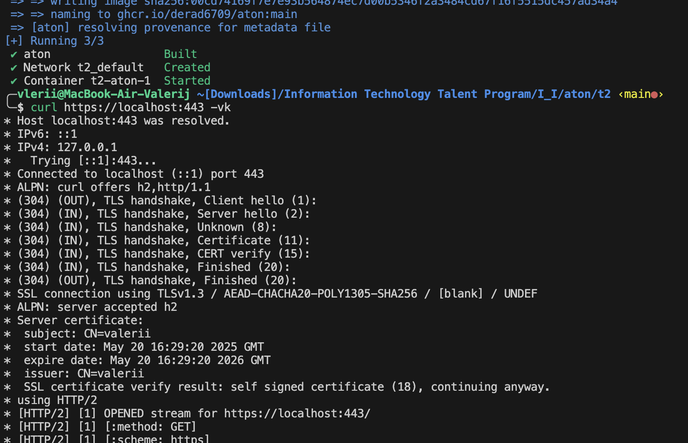

Create TLS-certificate:
```zsh
mkdir certs
cd certs
openssl req -x509 -nodes -days 365 -newkey rsa:2048 -keyout nginx.key -out nginx.crt -subj "/CN=valerii"
cd ..
```

Run `docker-compose`:
```zsh
sudo docker-compose up -d --build
```

Verify the availability:
```zsh
curl https://localhost:443 -vk
```

